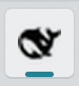
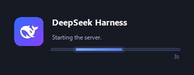

# dsh-web-desktop

把 **DeepSeek Harness（`dsh web`）** 的浏览器界面变成"像一个桌面应用"：

- **Chrome App 模式窗口** —— 没有地址栏，标题就是 `DeepSeek Harness`，任务栏上是**它自己的按钮**（不再和浏览器窗口挤在一起），按钮图标是 DSH 的鲸鱼。这部分是一个真正的 **dsh 插件**。
- **Windows 一键启动器** —— 后台静默起服务、启动等待卡片、开始菜单 / 桌面 / 任务栏入口、一键停止。这部分是 Windows 侧的启动器和快捷方式。

| 任务栏按钮 | 启动等待卡片 |
|---|---|
|  |  |

> 实测环境：Windows 11 (21H2) + Google Chrome 153 + dsh `0.1.5-rc.2`。

---

## 目录

- [它到底解决什么问题](#它到底解决什么问题)
- [环境要求](#环境要求)
- [安装方式 A：dsh 插件（推荐给习惯命令行的人）](#安装方式-adsh-插件推荐给习惯命令行的人)
- [安装方式 B：Windows 启动器（推荐给想"点图标就用"的人）](#安装方式-bwindows-启动器推荐给想点图标就用的人)
- [安装方式 C：两个都装（推荐组合）](#安装方式-c两个都装推荐组合)
- [日常使用](#日常使用)
- [固定到任务栏](#固定到任务栏)
- [它是怎么工作的](#它是怎么工作的)
- [排错](#排错)
- [已知限制](#已知限制)
- [卸载](#卸载)
- [开发说明](#开发说明)
- [English](#english)

---

## 它到底解决什么问题

`dsh web` 默认的行为是：在你**系统默认浏览器**里打开一个普通标签页。这带来三个体验问题：

1. 任务栏上是**浏览器**的图标和分组，和一堆网页混在一起，不像一个应用；
2. 每次都要留一个终端窗口跑着服务，关掉终端服务就没了；
3. 冷启动要等 7～25 秒，期间**毫无反馈**。

这个项目针对性地解决这三点。它分成两个可以独立使用的部分，因为它们的实现层面完全不同：

| 部分 | 是什么 | 解决 |
|---|---|---|
| **dsh 插件**（仓库根目录本身就是一个 npm 包） | 一个 Cordis bundle，改 web profile 的浏览器交接逻辑，自己用 `chrome --app=<url>` 打开界面 | 问题 1 |
| **Windows 启动器**（`windows/` 目录） | PowerShell 启动器 + 快捷方式安装脚本 | 问题 2、3 |

插件做不到创建 Windows 快捷方式；启动器做不到"让任何方式启动的 `dsh web` 都开 App 窗口"。所以仓库里两者都提供，按需安装。

---

## 环境要求

| 项目 | 要求 |
|---|---|
| 操作系统 | **Windows 10/11**（启动器部分；插件部分在 macOS / Linux 上也能用） |
| Node.js | ≥ 20（dsh 本身的要求） |
| dsh | `npm i -g @deepseek-ai/dsh` 可用的 `dsh` 命令 |
| Google Chrome | **必须**。App 模式窗口是 Chromium 的能力，且本项目只针对 Chrome |
| pnpm | 仅**安装方式 A** 需要（`npm i -g pnpm`） |
| git | 仅**安装方式 A** 从 GitHub 直接安装时需要 |

---

## 安装方式 A：dsh 插件（推荐给习惯命令行的人）

装完之后，**你用任何方式启动 `dsh web`，界面都会以 Chrome App 窗口打开**。

```powershell
# 1) dsh 的插件管理是 pnpm 的转发器，先确保有 pnpm（只需一次）
npm i -g pnpm

# 2) 把本仓库作为一个 bundle 装进 web profile
dsh plugin --profile web add -w github:<YOUR_GITHUB_USER>/dsh-web-desktop

# 3) 重启 dsh web
dsh web
```

> **`-w` 不能省。** profile 目录本身是一个 pnpm workspace 根（`pnpm-workspace.yaml` 里 `packages: - .`），不加 `-w` 时 pnpm 会拒绝并报
> `ERR_PNPM_ADDING_TO_ROOT`。`dsh plugin` 只是把参数原样转发给 pnpm，所以这个标志由你传。
>
> 安装完成后 dsh 会**自动**把这个包登记成 profile 的一层（`dsh.profile.bundles` 里多出 `dsh-web-desktop`），因为它的 `package.json` 声明了 `dsh.bundle.patch`。
>
> 目标 profile 需要包含 web 组合包（`@deepseek-ai/dsh-web-app`）。装到别的 profile 里不会报错，但那一层 patch 匹配不到 `web-runtime` 行，只会被警告并跳过。

<details>
<summary>用本地目录安装（开发 / 试用）</summary>

```powershell
git clone https://github.com/<YOUR_GITHUB_USER>/dsh-web-desktop
cd dsh-web-desktop
dsh plugin --profile web add -w .
```

`dsh plugin` 会把相对路径锚定到你**当前所在目录**，所以在仓库目录里执行 `add -w .` 是安全的（不会把 profile 自己链接进去）。
</details>

**验证装上了**：

```powershell
# profile 的 bundles 列表里应该出现 dsh-web-desktop
Get-Content "$env:USERPROFILE\.dsh\profiles\web\package.json"
```

**卸载**：

```powershell
dsh plugin --profile web remove dsh-web-desktop
```

---

## 安装方式 B：Windows 启动器（推荐给想"点图标就用"的人）

装上之后，开始菜单会出现 **DSH Web**（打开）、**DSH Web (Restart)**（重启）、**DSH Web (Stop)**（停止）三个入口，桌面会出现 **DSH Web** 和 **DSH Web (Restart)** 两个入口；点击后在后台起服务，界面以 Chrome App 窗口打开。

> **重启为什么要单独一个图标**：普通图标在服务已经在跑时只会把界面打开，不会重启。想让 dsh 重新加载插件（改了插件代码、装了新插件）就必须重启服务，而这件事不能要求用户去开命令行 —— 所以**重启有一个桌面图标**，双击即可，脚本会先确认占用端口的是 dsh 自己（node），再停服务、等服务真正释放端口、然后重新起，最后开界面。

```powershell
git clone https://github.com/<YOUR_GITHUB_USER>/dsh-web-desktop
cd dsh-web-desktop

# 交互式看一遍脚本内容再执行，永远是好习惯
powershell -NoProfile -ExecutionPolicy Bypass -File .\windows\install.ps1
```

安装脚本**不需要管理员权限**，它只做三件事：把启动器复制到 `%USERPROFILE%\.dsh\launchers\`、创建快捷方式、跑一次自检并打印结果。

### 可选的安装参数

| 参数 | 默认 | 说明 |
|---|---|---|
| `-Workspace <路径>` | `%USERPROFILE%` | dsh 的工作目录（GUI 里新建会话的默认目录） |
| `-Port <端口>` | `3080` | 监听端口 |
| `-InstallDir <路径>` | `%USERPROFILE%\.dsh\launchers` | 启动器安装位置 |
| `-NoDesktopShortcut` | — | 不创建桌面快捷方式 |
| `-NoStartMenuShortcut` | — | 不创建开始菜单快捷方式 |

例如：

```powershell
powershell -NoProfile -ExecutionPolicy Bypass -File .\windows\install.ps1 -Workspace D:\work -Port 8080
```

---

## 安装方式 C：两个都装（推荐组合）

两半是**协同设计**的，一起装效果最好：

- 插件负责"把界面用 Chrome App 窗口打开"；
- 启动器负责"点图标就能用"。

启动器在启动服务时会传 `--no-open`，插件看到这个参数就**不会**再自己开一个窗口 —— 所以不会出现开两个窗口的问题。

```powershell
npm i -g pnpm
dsh plugin --profile web add -w github:<YOUR_GITHUB_USER>/dsh-web-desktop
powershell -NoProfile -ExecutionPolicy Bypass -File .\windows\install.ps1
```

---

## 日常使用

点击 **DSH Web** 之后：

1. 端口空闲 → 后台静默启动 `dsh web`（不弹黑窗口），**超过 2 秒**会显示一张居中的等待卡片（当前阶段 + 已等待秒数），界面交给浏览器后卡片自动消失；
2. 端口上已经有 dsh 在跑 → 不重复启动，直接用记下来的带 token 地址打开界面；
3. 端口被**别的程序**占用 → 弹窗提示，不会瞎启动；
4. 加了 `-Restart` → 先停掉端口上的 dsh（确认是 node 才动手），**等端口真正释放**再重新启动，最后开界面。

**停止**：点 **DSH Web (Stop)**（或命令行 `-Stop`）。
**重启**：点 **DSH Web (Restart)**（或命令行 `-Restart`）—— 改了插件、想重新加载时用这个。

> 等待卡片里的进度条由一张自绘控件的**自己的定时器**驱动（约 60 fps 平滑往返 + 缓动），不依赖 PowerShell 主循环去"喂"它绘制。原来的写法是在轮询循环里 `DoEvents()` + 每 15ms 重算一次位置，循环一忙（探端口、等进程退出）进度条就卡成"一秒跳一下"。

**日志**在启动器目录的 `logs\` 下：

| 文件 | 内容 |
|---|---|
| `dsh-web.log` | 启动器自己的动作记录 |
| `dsh-web.out.log` / `dsh-web.err.log` | dsh 进程的原始输出 |
| `current-url.txt` | 上一次带 token 的登录地址（**含凭据，别外发**） |

**自检**：

```powershell
powershell -NoProfile -ExecutionPolicy Bypass -File "$env:USERPROFILE\.dsh\launchers\dsh-web.ps1" -Check
```

会打印：端口占用情况、dsh 入口路径、找到的 Chrome、工作目录是否存在、日志目录。

**启动器的全部参数**：

| 参数 | 说明 |
|---|---|
| `-Stop` | 停止监听该端口的 dsh 进程（会先确认占用者是 node，不会误杀别的程序） |
| `-Restart` | 先停掉该端口上的 dsh、等端口释放，再重新启动并打开界面（桌面"重启"图标用的就是这个） |
| `-Check` | 只打印诊断信息 |
| `-Port <端口>` | 默认 3080 |
| `-Workspace <路径>` | 默认 `%USERPROFILE%` |
| `-NoBrowser` | 只起服务，不开浏览器 |
| `-NoAppMode` | 关掉 App 模式（退回"交给系统默认浏览器"） |
| `-Browser <路径>` | 指定 Chrome 可执行文件（默认自动查找） |

---

## 固定到任务栏

Windows 11 **没有**给程序提供"替用户固定到任务栏"的接口（旧的 `taskbarpin` 动词已被移除，只剩"固定到开始屏幕"），所以这一步必须手动点一次：

1. 开始菜单 → 搜索 `DSH Web` → 右键 → **更多 → 固定到任务栏**；
2. 或者把桌面上的 `DSH Web` 快捷方式**直接拖到任务栏**。

> 建议固定**启动器**（会负责起服务），而不是运行中的 App 窗口那个按钮 —— 后者单独固定的话，服务没起来时点它只会看到打不开的页面。

---

## 它是怎么工作的

### 插件的部分

本仓库根目录就是一个 npm 包，`package.json` 里声明了：

```json
"dsh": { "bundle": { "patch": "./cordis.patch.yml" } }
```

`dsh plugin --profile web add` 装好依赖后，dsh 会把这个包**作为一层 patch 追加到 web profile 的组合里**（`dsh.profile.bundles`）。这一层做两件事：

1. 覆盖 `web-runtime` 行的 `openBrowser: false` —— 关掉内置的"交给系统默认浏览器"；
2. `insert` 一行自己的插件 `lib/index.js`。

插件在**配置树结算完成**的同一时刻（和内置交接相同的就绪点）解析出**带 token 的已认证 URL**，然后：

```
chrome.exe --app=http://127.0.0.1:3080/?token=...
```

`--app=` 是 Chromium 的 App 模式：无地址栏，并且 Chromium 会为它构造**独立的 AppUserModelID**（实测为 `Chrome.127.0.0.1_/`），Windows 按 AUMID 分组，所以它**独立成一个任务栏按钮**，图标取站点 favicon（就是那只鲸鱼）。参考 Chromium 官方文档：[Windows Shortcut and Pinned Taskbar Icon handling](https://raw.githubusercontent.com/chromium/chromium/main/docs/windows_shortcut_and_taskbar_handling.md)。

插件还遵守 `dsh web --no-open`：传了这个参数说明"有人负责开窗口"，它就安静不动。

### 启动器的部分

- 用 `Start-Process -WindowStyle Hidden` 起 `node <dsh>/lib/bin.js web --port <n> --no-open`，所以不弹控制台窗口；
- 从 stdout 里抓 `dsh web: <url>` 这一行，把带 token 的地址记到 `logs\current-url.txt`（token 在服务进程生命周期内有效，所以后续点击也能用它登录，**换浏览器也不必重新认证**）；
- 端口忙时先用一个无 cookie 请求探测：dsh 会回 **401**，别的程序不会 —— 以此判断"能复用"还是"被别人占了"；
- 等待卡片是 PowerShell 自带的 WinForms 窗口，用 `WS_EX_NOACTIVATE` + `WS_EX_TOOLWINDOW` 保证它**不抢焦点、不占任务栏按钮、不进 Alt-Tab**（实测窗口扩展样式 `0x08010088`，前台窗口判定为 false）；
- 日志里含 token 的地址在弹窗展示时会被打码。

---

## 排错

**打开的页面是 401 / 未授权**

说明这个浏览器还没有该服务的有效 cookie，而且当前端口上的 dsh **不是由启动器启动的**（启动器拿不到它的 token）。把那个 dsh 关掉，再点一次图标即可（冷启动会带 token 打开）。之后 cookie 有 30 天有效期。

**任务栏按钮的悬停提示显示 `Google Chrome - 1 个运行窗口`**

这是 Chromium 的 AUMID 命名决定的，**只有"安装为 PWA"的应用才有自己的名字**。我实测过用注册表 `HKCU\Software\Classes\AppUserModelId\Chrome.127.0.0.1_/` 写 `DisplayName`/`IconUri`，**在 Windows 11 上对任务栏完全无效**（前后截图逐像素一致），所以本项目不去改注册表。图标本身是正确的鲸鱼。

**等待卡片没出现**

- 端口上已有服务时走复用路径（1～2 秒），按设计不显示卡片；
- 如果机器上 WinForms 不可用，日志会记一条 `splash: unavailable (...)`，启动流程照常进行。

**提示找不到 Chrome**

App 模式需要 Chrome。启动器会按 PATH、`%LOCALAPPDATA%`、`%ProgramFiles%`、`%ProgramFiles(x86)%` 依次查找 `chrome.exe`；可以显式指定：

```powershell
... -File "$env:USERPROFILE\.dsh\launchers\dsh-web.ps1" -Browser "D:\Chrome\chrome.exe"
```

找不到时会退回系统默认浏览器打开（功能照常，只是没有独立任务栏按钮）。插件的表现是打印一行提示并给出 URL。

**`dsh plugin` 报 `pnpm not found on PATH`**

`dsh plugin` 是 pnpm 的转发器，先 `npm i -g pnpm`。

**`dsh plugin ... add` 报 `ERR_PNPM_ADDING_TO_ROOT`**

profile 目录是 pnpm 的 workspace 根，加上 `-w`：

```powershell
dsh plugin --profile web add -w github:<YOUR_GITHUB_USER>/dsh-web-desktop
```

（`remove` 不需要 `-w`。）

**从 GitHub 安装插件时 pnpm 提示 build script 被拦截**

只有带 `prepare` 构建脚本的包才会遇到（本包是纯 JS，没有构建步骤）。真遇到时按 pnpm 的提示把 key 加到 `%USERPROFILE%\.dsh\profiles\web\pnpm-workspace.yaml` 的 `allowBuilds` 里再重试。

---

## 已知限制

- **只针对 Google Chrome**：Edge 等其它 Chromium 浏览器理论上也能工作（改 `-Browser`），但没有测试覆盖。
- **App 窗口的任务栏名称**是 Chromium 的 `Google Chrome`（见上文），改不了。
- **固定到任务栏必须手动一次**：Windows 11 没有提供接口。
- **LAN 访问不在范围内**：`dsh web` 出于安全只监听回环地址，本项目不改变这一点。
- 插件的实现依赖 dsh 的 `webStartup` / `webServer` / `connection` 三个服务与 `web-runtime` 这个 profile 行；dsh 大版本升级后如果这几处改名，插件需要跟着更新。

---

## 卸载

```powershell
# 启动器（会先停掉它自己的服务，再删快捷方式和安装目录）
powershell -NoProfile -ExecutionPolicy Bypass -File .\windows\uninstall.ps1
# 想保留日志： -KeepLogs

# 插件
dsh plugin --profile web remove dsh-web-desktop
```

卸载脚本**不会**碰你的 dsh 安装、你的 `~/.dsh` profile，或任何别的插件。

---

## 开发说明

```
dsh-web-desktop/
├─ package.json          # 同时是 npm 包与 dsh bundle 声明
├─ cordis.patch.yml      # 插件这一层的 profile patch
├─ lib/index.js          # Cordis 插件本体（纯 Node 内置模块，零依赖）
├─ windows/
│  ├─ dsh-web.ps1        # 启动器
│  ├─ install.ps1        # 安装
│  └─ uninstall.ps1      # 卸载
├─ assets/               # 图标与截图
└─ tools/make-icon.mjs   # 从 dsh 内置 favicon 重新生成图标（开发用，需要 sharp）
```

- 三个 `.ps1` **全部只用 ASCII 字符**，这是刻意的：Windows PowerShell 5.1 会把不带 BOM 的 `.ps1` 当 ANSI 读，任何非 ASCII 文本在代码页不同的机器上都会乱码。要改中文文案，请改 README 而不是脚本。
- 图标可以用 `node tools/make-icon.mjs` 重新生成（`npm i -D sharp`，会从你本机 dsh 安装里的 `favicon.svg` 取图）。
- 想同时改插件和启动器时：插件改动需要重启 `dsh web`（或等 profile 热重载），启动器改动需要重新跑一次 `install.ps1` 才会同步到 `%USERPROFILE%\.dsh\launchers\`。

---

## English

**dsh-web-desktop** makes the DeepSeek Harness web GUI behave like a desktop app on Windows: it opens in a **Chrome app window** (no address bar, its own taskbar button showing the DSH icon) instead of a browser tab, and it ships a **launcher** that boots the server in the background with a startup card, plus Start Menu / Desktop / taskbar entries.

Requirements: Windows 10/11, Node ≥ 20, `@deepseek-ai/dsh`, Google Chrome. pnpm + git only for the plugin path.

```powershell
# A. the plugin: any `dsh web` then opens the Chrome app window
npm i -g pnpm
dsh plugin --profile web add -w github:<YOUR_GITHUB_USER>/dsh-web-desktop

# B. the launcher: click an icon instead of typing
git clone https://github.com/<YOUR_GITHUB_USER>/dsh-web-desktop
cd dsh-web-desktop
powershell -NoProfile -ExecutionPolicy Bypass -File .\windows\install.ps1

# uninstall
powershell -NoProfile -ExecutionPolicy Bypass -File .\windows\uninstall.ps1
dsh plugin --profile web remove dsh-web-desktop
```

Pin it once by hand (Windows 11 exposes no API for scripts): Start menu → search `DSH Web` → right click → More → Pin to taskbar.

---

## License

[MIT](LICENSE)
